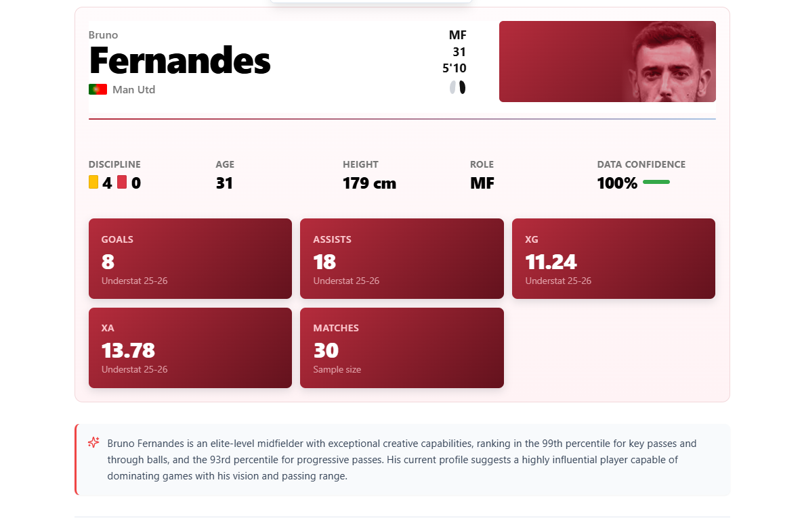
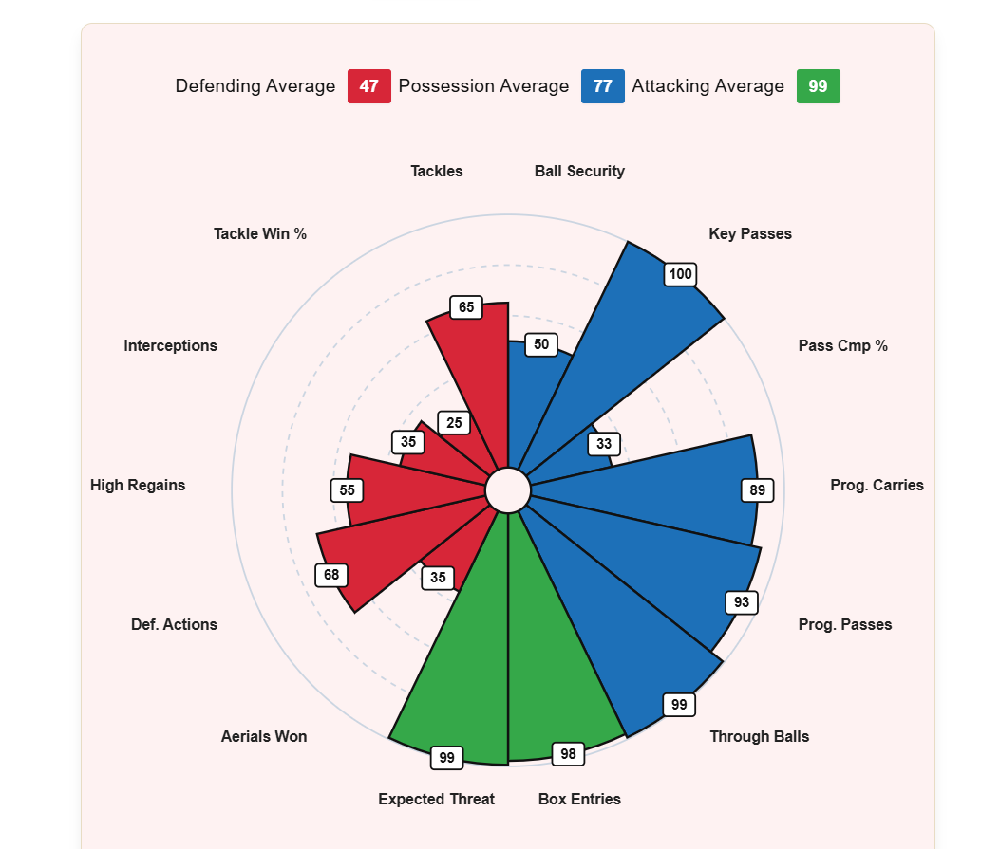
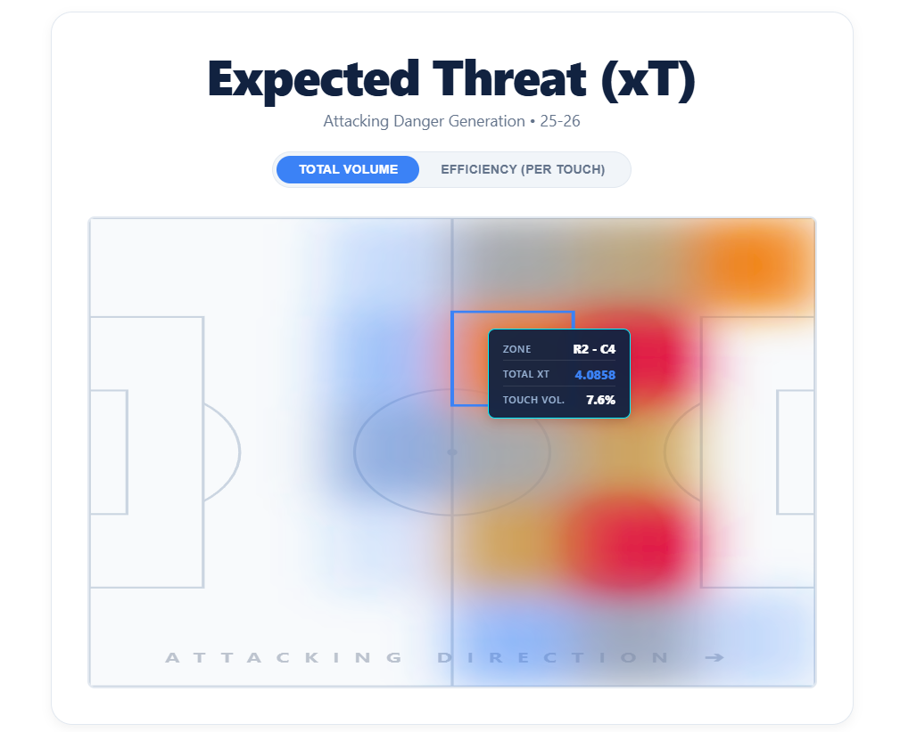
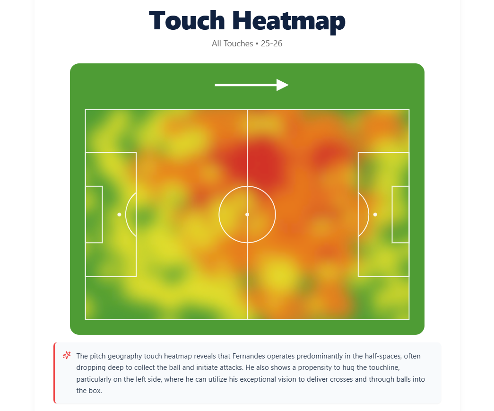
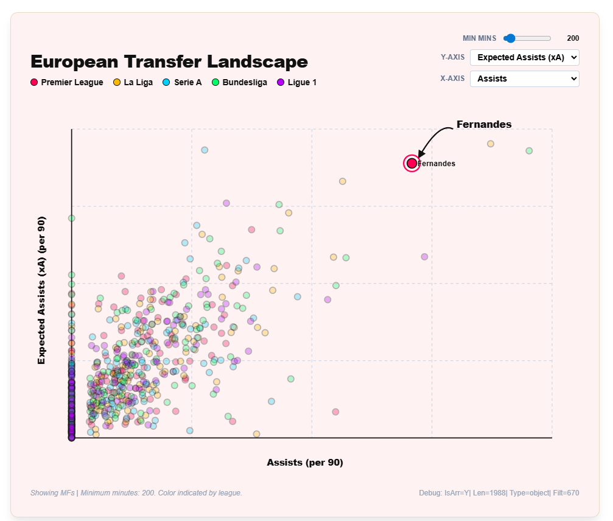
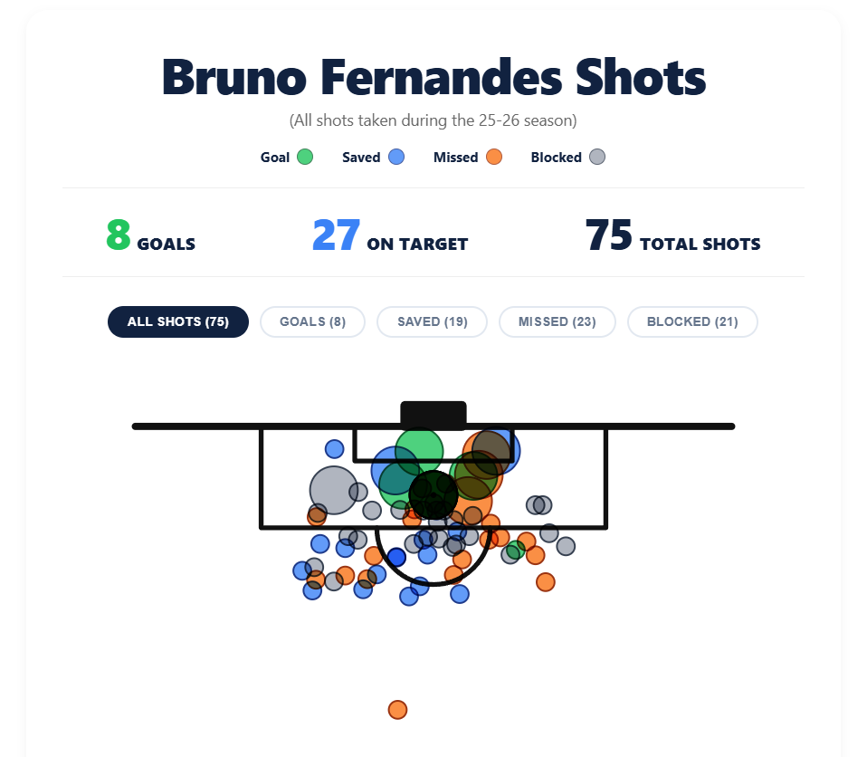

<div align="center">
  <h1>⚽ Scout Reports Generator</h1>
  <p><strong>Professional-Grade Football Analytics & Scouting Intelligence Platform</strong></p>
  <p>
    <em>Transforming raw event data into elite scouting intelligence — one data point at a time.</em>
  </p>

  [](https://fastapi.tiangolo.com/)
  [](https://reactjs.org/)
  [](https://www.mongodb.com/)
  [](https://www.python.org/)
  [](https://www.typescriptlang.org/)
</div>

---

**Scout Reports Generator** is a full-stack football analytics platform built for data-driven scouting at an elite level. It ingests millions of granular match event records through a custom ETL pipeline, runs unsupervised machine learning to map player tactical styles, and surfaces deep insights through a professional, interactive dashboard. Every visualization is backed by real statistical models — from Bayesian-adjusted percentile rankings to Z-score translated league projections.

---

## 📸 Platform Preview

<table>
  <tr>
    <td align="center" width="50%">
      
      <br/><sub><b>Player Scout Dashboard — AI-generated summary with live xG, xA, and goal stats</b></sub>
    </td>
    <td align="center" width="50%">
      
      <br/><sub><b>Pizza Chart — Bayesian-adjusted percentile radar across 14+ elite metrics</b></sub>
    </td>
  </tr>
  <tr>
    <td align="center" width="50%">
      
      <br/><sub><b>Expected Threat (xT) Map — Spatial danger generation by pitch zone</b></sub>
    </td>
    <td align="center" width="50%">
      
      <br/><sub><b>Touch Heatmap — Pitch geography and positional influence visualization</b></sub>
    </td>
  </tr>
  <tr>
    <td align="center" width="50%">
      
      <br/><sub><b>European Transfer Landscape — Cross-league scatter plot with 1,900+ Top 5 players</b></sub>
    </td>
    <td align="center" width="50%">
      
      <br/><sub><b>Shot Map — Season-level shot placement with outcomes and xG bubble sizing</b></sub>
    </td>
  </tr>
</table>

---

## ✨ Features

### 🧠 Analytics Engine
- **Percentile Rankings with Bayesian Gravity** — Per-player percentile scores computed against positional peers using `scipy`. Low-minute players are pulled toward the median to prevent small-sample anomalies from skewing the output.
- **K-Means Tactical Clustering** — Unsupervised ML clusters players into tactical archetypes (Striker, Winger, CenterBack, etc.) using position-specific feature vectors. PCA reduces to 2D for the scatter plot.
- **League Projection Engine** — Translates a player's raw stats into a projected Z-score impact across the Top 5 European leagues, weighted by live UEFA Country Coefficients (e.g. Premier League: 1.000, La Liga: 0.821).
- **Season Distributions** — Aggregate metric distributions (mean, std, 10 percentile breakpoints) stored per position group, powering cross-player comparison without repeated DB scans.

### 📊 Visualizations
- **Pizza Charts** — 14-metric radial percentile chart split into Attacking, Possession, and Defending segments with color-coded wedges.
- **Expected Threat (xT) Map** — A 12×8 zone grid overlaid on a pitch, showing where a player generates the most attacking danger, switchable between total volume and per-touch efficiency.
- **Touch Heatmap** — Kernel-density rendered positional influence map showing where a player operates across the full pitch.
- **Shot Map** — Season-level all-shots view with bubble sizing proportional to xG values, filterable by outcome (Goal, Saved, Missed, Blocked).
- **European Transfer Landscape** — A live interactive scatter plot of 1,900+ players across 5 leagues, with configurable X/Y axes, minimum minutes filter, and a highlighted target player.

### 🤖 AI Scout Annotations
- **Groq LLM Integration** — After loading a player profile, StatScout automatically generates a contextual scouting paragraph using live stats as context, powered by the Groq API.

---

## 🏗️ Architecture

```
┌─────────────────────────────────────────────────────────────┐
│                        Frontend (Vite + React 18)           │
│   ScoutReportsPage → [Header | PizzaChart | xTMap |        │
│    ShotMap | Heatmap | ScatterPlot | AiAnnotation]          │
└────────────────────────┬────────────────────────────────────┘
                         │ REST (axios)
┌────────────────────────▼────────────────────────────────────┐
│                 Backend (FastAPI + Uvicorn)                  │
│   /api/v1/scout-reports  →  scout_reports_service           │
│   /api/v1/spatial        →  scatter_service                 │
│   /api/v1/ai             →  groq_service                    │
└────────────────────────┬────────────────────────────────────┘
                         │ Motor (async)
┌────────────────────────▼────────────────────────────────────┐
│                    MongoDB Atlas (statscout_db)              │
│  player_spatial_profiles │ season_distributions             │
│  match_player_stats      │ player_bio                       │
│  understat_league_cache  │ player_shot_data                 │
└─────────────────────────────────────────────────────────────┘
                         ▲
                         │ ETL Pipeline
┌────────────────────────┴────────────────────────────────────┐
│              Data Pipeline (Python)                          │
│   spatial_aggregator.py  →  Parquet → per_90 aggregation   │
│   style_clusterer.py     →  K-Means + PCA + Percentiles    │
└─────────────────────────────────────────────────────────────┘
```

---

## 🚀 Getting Started

### Prerequisites
- Python **3.10+**
- Node.js **18+**
- A MongoDB Atlas cluster (or local MongoDB instance)
- A [Groq API key](https://console.groq.com/) (free tier available)

---

### 1. Clone & Configure

```bash
git clone https://github.com/talal-atiq/scout-reports.git
cd scout-reports
```

**Backend environment:**
```bash
cd backend
cp .env.example .env
```

Open `.env` and fill in your credentials:
```env
MONGODB_URL=mongodb+srv://<username>:<password>@<cluster-host>/?appName=<AppName>
MONGODB_DB_NAME=statscout_db
GROQ_API_KEY=your_groq_api_key_here
```

---

### 2. Backend

```bash
cd backend

# Create and activate virtual environment
python -m venv venv
venv\Scripts\activate      # Windows
# source venv/bin/activate # macOS / Linux

# Install dependencies
pip install -r requirements.txt

# Start the API server
python run.py
```

> API available at `http://localhost:8000` · Swagger docs at `http://localhost:8000/api/docs`

---

### 3. Frontend

```bash
cd frontend
npm install
npm run dev
```

> App available at `http://localhost:5173`

---

## 🗄️ Data Pipeline

StatScout's analytics are powered by a two-stage ETL pipeline that runs independently from the live API:

**Stage 1 — `spatial_aggregator.py`**
Reads raw match event data (passes, shots, carries, defensive actions) from `.parquet` files, aggregates them into per-90 metrics, and builds a `style_fingerprint` vector for each player.

**Stage 2 — `style_clusterer.py`**
Loads all `player_spatial_profiles` for a given league+season, runs K-Means clustering (k=4) and PCA per position pool, computes Bayesian-adjusted percentiles, writes season distributions to MongoDB.

```bash
# Run the clustering pipeline for a specific league
python style_clusterer.py --league "La Liga" --season "2025/2026"

# Dry run to preview output without writing to DB
python style_clusterer.py --league "Premier League" --dry-run
```

> **Note:** Raw `.parquet` event files are `.gitignore`'d due to size. Place them under `backend/data/events/<league>/` to run the pipeline locally.

---

## 📂 Project Structure

```
scout-reports/
├── backend/
│   ├── app/
│   │   ├── api/
│   │   │   └── routes/         # FastAPI route handlers (scout-reports, spatial, ai)
│   │   ├── core/               # DB connection, config, middleware
│   │   ├── schemas/            # Pydantic response models
│   │   └── services/           # Business logic (scatter, transfermarkt, groq)
│   ├── etl/                    # ETL-specific configs & requirements
│   ├── models/                 # Serialized ML model artifacts
│   ├── spatial_aggregator.py   # Stage 1: event → per_90 aggregation
│   ├── style_clusterer.py      # Stage 2: clustering + percentiles
│   ├── requirements.txt        # API dependencies
│   └── run.py                  # Uvicorn entry point
├── frontend/
│   └── src/
│       ├── api/                # Axios API clients
│       ├── components/         # Visualizations: PizzaChart, ShotMap, xTMap, etc.
│       ├── pages/              # ScoutReportsPage, ScatterPage
│       └── types/              # Shared TypeScript interfaces
├── docs/                       # Screenshots and documentation assets
└── README.md
```

---

## 🤝 Contributing

1. Fork the repository
2. Create a feature branch: `git checkout -b feat/your-feature`
3. Commit with a conventional commit message: `git commit -m "feat: add pass network visualization"`
4. Push and open a Pull Request

---

## 📄 License

Distributed under the MIT License.

---

<div align="center">
  <sub>Built with ❤️ for the beautiful game · <strong>Scout Reports Generator</strong></sub>
</div>
